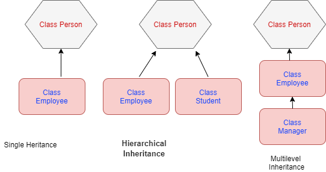

# what is oops ? 
 1. oops stands for object oriented programming structure language
 2. oops provides to hide data from some users 
 3. oops provides to secured our app 
 4. oops is partial support inside of javascript
 5. oops some concept is not supported in javascript
    examples: abstract class | polymorphism | data hiding process  

## oops features js 

   1. class
   2. object
   3. inheritance
      - single inheritance
      - multilevel inheritance
      - multiple inheritance (not supported in js)

    4. polymorphism

       - overloading 
       - overriding
    
    5. abstraction
    6- encapsulation

# oops partial support inside of js

# inheritance architectures 

