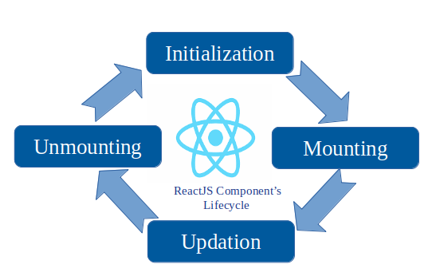

# what is react js or introduction of react js ?

1. react js is a library of javascript 
2. react js is create a GUI of any web application 
3. react js is components based create application 
4. react js used re-usables components
5. react js follow life cycle to create an web application 
7. react js pass data in components **parent to child***
8. react js used ES6.0 or ES7.0 structures 
10. react js version react js 15.0 or 16.0 or 17.0 or 18.0 or 19.0.0
11. react js is product of facebook developed and manage by facebook engineer 
12. react js used html elements via .jsx (javascript xml extension) any components saved in react js via .jsx 
13. react js components is an small peace of file that can be re-used data one components to another components and saved with .jsx or .js 
14. update data via virtual DOM 
15. 

   **components**

   1. About.jsx
   2. Services.jsx
   3. HelloWorld.jsx


**react js life cycle**

1. initialization 
2. mounting 
3. updating 
4. unmounting 


# architectures of react js life cycle 





1. **initializations** :

   ``` 
   initialization meanse start application to load data via its server 
   ```   

2. **mounting** :

  ```
  mounting meanse add data via DOM (document object model) to load on browsers
  ```

3. **updating** :
   
  ```
  updating  meanse update data one components to another components using state there we called updating

  ```
4. **unmounting** :

  ```
  unmounting  meanse removed data from state and closed the app
  
  ```


# advantages of react js ? 

1. **Component-Based Architecture**

React divides an application into small, reusable components.

2. **Reusable Components**

Components can be created once and reused many times.

3. **Virtual DOM**

React uses a Virtual DOM to efficiently update the browser UI.

4. **Fast Development**

React provides a component-based approach and a large ecosystem, allowing developers to build applications quickly.

5. **Easy to Learn**

If you already know:
HTML
CSS
JavaScript
ES6

6. **JSX**

React supports JSX (javascript xml extension), which allows HTML-like syntax inside JavaScript.

7. **One-Way Data Flow**

React generally follows one-way data flow.

8. **State Management**

React provides state to manage dynamic data or provides mutable objects.


9. **props Management**

React provides props to manage static data or provides immutable objects.


10. **Large Ecosystem** : support many libraries and tools

| Requirement	         |          Common Library   |
|------------------------|---------------------------|
|Routing	             |       React Router        | 
|Global State	         |       Redux Toolkit       |  
|Server State	         |       TanStack Query      |
|Forms	                 |       React Hook Form     |
|UI Components	Material |       UI                  |
|Icons	                 |       React Icons         | 
|Animation	             |       Framer Motion       |
|Charts	                 |       Recharts            |     

11. **strong community support**


# how to install react js or create a first react app  ?

1. first download and install node js in systems 
2. https://nodejs.org/en/download
3. check node js is install or not 
4. open cmd-->
5. node --version
6. check npm --version (node package manage)
7. check npx --version (node package extension)


# create react app via create-react-app appname

**cmd** :
    . npx create-react-app hello-world-app
    . cd hello-world-app
    . npm start
    . http://localhost:3000/


# create react app via vite package

**cmd** :
   
    . npm create vite@latest
    . press y
    . select react
    . select javascript
    . yes
    . yes
    . http://localhost:5173/

**run app**

    . cd appname
    . npm run dev
    . http://localhost:5173/
    

